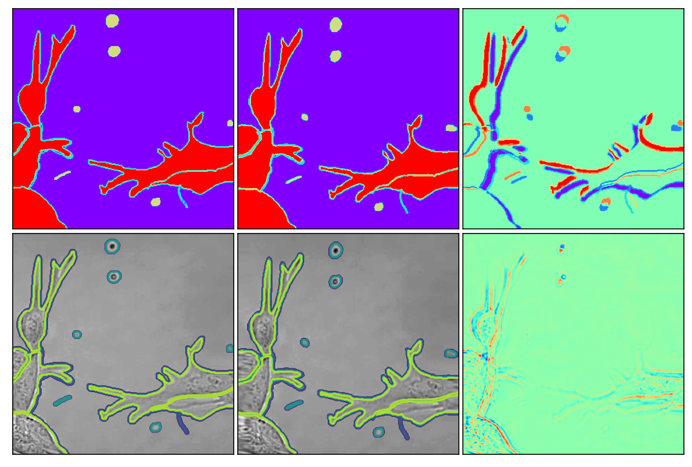
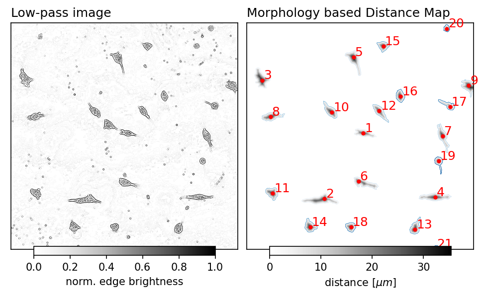
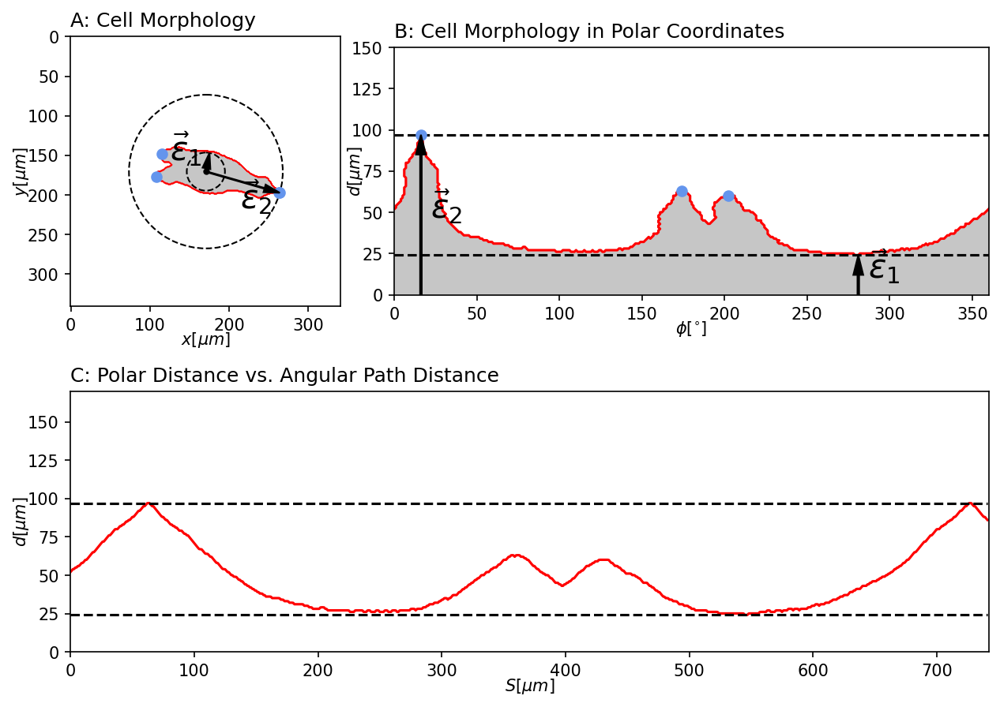

# Muroran IT - 細胞AI - Cell Activity

Evaluating cell activity from 2D time-lapse observations using UNET semantic segmentation.
This repository is supplementary information for the publication "A comprehensive approach for characterizing cell activity in low contrast microscopic images" by Stefan Baar, Masahiro Kuragano, Kiyotaka Tokuraku, and Shinya Watanabe.

The repository does not present the complete data reduction procedure, but presents the essential processing steps to obtain the results presented in the paper.

For the paper we have analyzed more than 70 time lapse observations (Raw ~7GB, Evaluated ~1TB). We can not provide the entire set of raw and annotation data. Instead we provide one annotation sample and ten raw image samples. Further, we provide pre-trained UNET models.


## Setup
We do not provide a pip package yet. Just git clone the repository and run within the main directory.
This project was written for python 3.8-dev, but all python version from 3.6 should also work.

## Notebooks
The basic processing steps a elaborated within a set of jupyter notebooks 1-3.

### Image preparation
The notebook, [image preparations](01_image_preparation.ipynb) presents the basic idea on how to create distortion based image augmentation and generation as mentioned in section 3 of the paper.


### Training

Training can be performed using activity/train.py and data_prep.py ot by following the notebook [training](02_training.ipynb).

### Image enhancement and protrusion detection

The a simplified version of cell protrusion evaluation is elaborated in the notebook [protrusions](03_protrusions.ipynb).



## Cell activity estimation computations
An example pipeline to compute the various parameters to evaluate cell activity can by performed by running:

```bash
python run_example.py
```

which computes a set of numpy arrays saved to data/npy/.
